---
title: "Hands-On Lab: Deploying and Configuring Azure Firewall for Network Security"  
description: "Step-by-step guide to deploying Azure Firewall, configuring network/application rules, and validating secure traffic flow in Azure Virtual Networks."  
date: 2025-02-01  
draft: false  
summary: "A technical walkthrough of Azure Firewall implementation, covering route configuration, DNS management, and firewall rule validation. Demonstrates traffic control between subnets and compliance testing using real-world security scenarios."  
tags: [Azure-Firewall, Network-Security, Cloud-Infrastructure, Traffic-Routing]  
categories: [Cloud Security, Azure Labs, Network Administration]  
---

**Introduction**

In LAB\_03\_AzureFirewall, we will learn how to deploy and configure Azure Firewall, a critical component for securing an Azure Virtual Network. Azure Firewall is a managed cloud-based network security service designed to protect Azure resources by controlling and monitoring network traffic. Throughout this lab, we will gain practical experience in setting up Azure Firewall. By the end of this lab, we will have a solid understanding of how to implement and manage Azure Firewall to enhance the security and compliance of Azure infrastructure.

**Lab scenario**

You have been asked to install Azure Firewall. This will help your organization control inbound and outbound network access which is an important part of an overall network security plan. Specifically, you would like to create and test the following infrastructure components:

- A virtual network with a workload subnet and a jump host subnet.
- A virtual machine is each subnet.
- A custom route that ensures all outbound workload traffic from the workload subnet must use the firewall.
- Firewall Application rules that only allow outbound traffic to www.bing.com.
- Firewall Network rules that allow external DNS server lookups.

For all the resources in this lab, we are using the **East US** region. Verify with your instructor this is the region to use for class.

**Lab objectives**

In this lab, you will complete the following exercise:

- Exercise 1: Deploy and test an Azure Firewall

**Azure Firewall diagram**

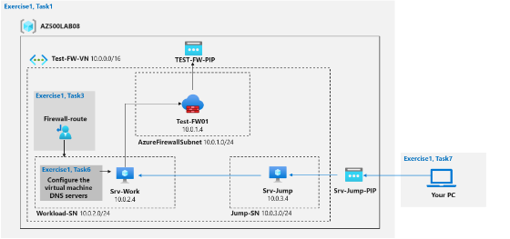

**Exercise 1: Deploy and test an Azure Firewall**

**Estimated timing: 40 minutes**

For all the resources in this lab, we are using the **East Asia** region.

- Task 1: Use a template to deploy the lab environment.
- Task 2: Deploy an Azure firewall.
- Task 3: Create a default route.
- Task 4: Configure an application rule.
- Task 5: Configure a network rule.
- Task 6: Configure DNS servers.
- Task 7: Test the firewall.

**Task 1: Use a template to deploy the lab environment.**

In this task, you will review and deploy the lab environment.

In this task, you will create a virtual machine by using an ARM template. This virtual machine will be used in the last exercise for this lab.

1. Sign-in to the Azure portal **https://portal.azure.com/**.

   **Note**: Sign in to the Azure portal using an account that has the Owner or Contributor role in the Azure subscription you are using for this lab.

2. In the Azure portal, in the **Search resources, services, and docs** text box at the top of the Azure portal page, type **Deploy a custom template** and press the **Enter** key.
2. On the **Custom deployment** blade, click the **Build your own template in the editor** option.
2. On the **Edit template** blade, click **Load file**, locate the **\Allfiles\Labs\08\template.json** file and click **Open**.

   **Note**: Review the content of the template and note that it deploys an Azure VM hosting Windows Server 2016 Datacenter.

   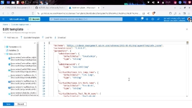

5. On the **Edit template** blade, click **Save**.

   Had to edit the template from eastus to eastasia due to errors in Azure Regions resources allowed. On the template file click Ctrl+F to find and replace easily.

   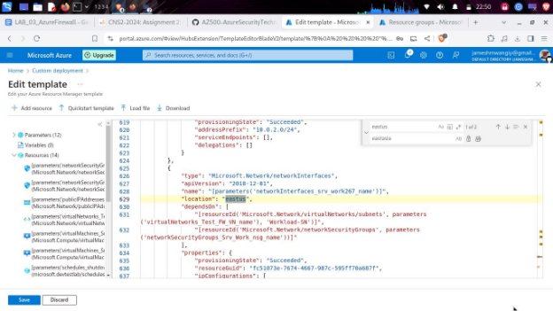

6. On the **Custom deployment** blade, ensure that the following settings are configured (leave any others with their default values):

   Setting Value

   Subscription the name of the Azure subscription

you will be using in this lab

Resource group click **Create new** and type the

name **AZ500LAB08**

Location **(US) East US**

Setting Value

adminPassword A secure password of your own

choosing for the virtual machines. Remember the password. You will need it later to connect to the VMs.

**Note**: To identify Azure regions where you can provision Azure VMs, refer to [**https://azure.microsoft.com/en-us/regions/offers/**](https://azure.microsoft.com/en-us/regions/offers/)

7. Click **Review + create**, and then click **Create**.

   **Note**: Wait for the deployment to complete. This should take about 2 minutes.

   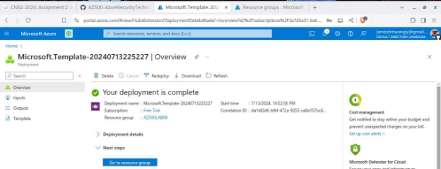

**Task 2: Deploy the Azure firewall**

In this task you will deploy the Azure firewall into the virtual network.

1. In the Azure portal, in the **Search resources, services, and docs** text box at the top of the Azure portal page, type **Firewalls** and press the **Enter** key.
1. On the **Firewalls** blade, click **+ Create**.
1. On the **Basics** tab of the **Create a firewall** blade, specify the following settings (leave others with their default values):

4

Setting

Resource group Name

Region

Firewall SKU Firewall management

Choose a virtual network Public IP address

Value **AZ500LAB08 Test-FW01 (US) East US Standard**

**Use Firewall rules (classic) to manage this firewall**

click the **Use existing** option and, in the drop-down list, select **Test-FW-VN**

clck **Add new** and type the name **TEST-FW-PIP** and click **OK**

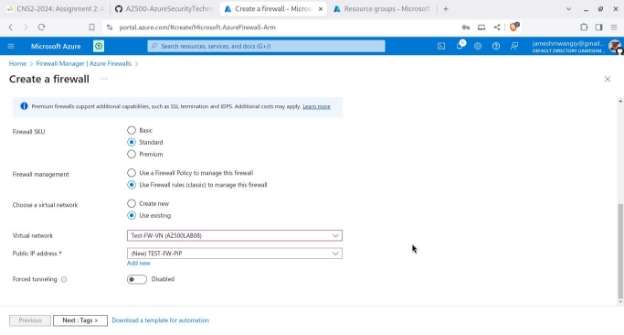

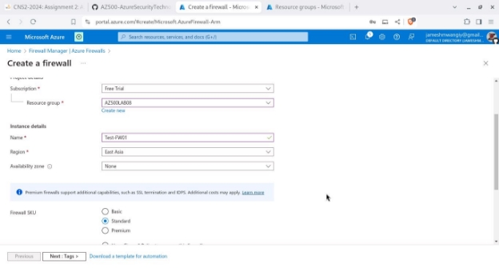

4. Click **Review + create** and then click **Create**.

   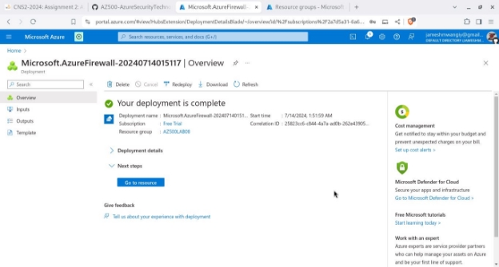

   **Note**: Wait for the deployment to complete. This should take about 5 minutes.

5. In the Azure portal, in the **Search resources, services, and docs** text box at the top of the Azure portal page, type **Resource groups** and press the **Enter** key.
5. On the **Resource groups** blade, in the list of resource group, click the **AZ500LAB08** entry.

   **Note**: On the **AZ500LAB08** resource group blade, review the list of resources. You can sort by **Type**.

7. In the list of resources, click the entry representing the **Test-FW01** firewall.
7. On the **Test-FW01** blade, identify the **Private IP** address that was assigned to the firewall. The private IP is 10.0.1.4, highlighted in blue in the image below

   **Note**: You will need this information in the next task.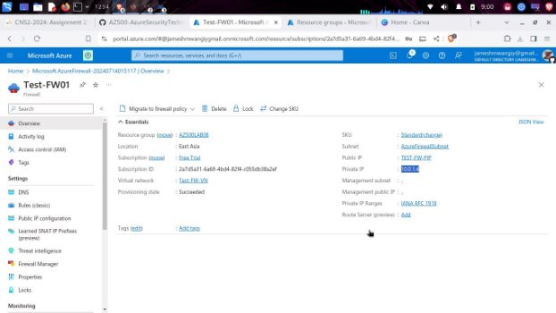

**Task 3: Create a default route**

In this task, you will create a default route for the **Workload-SN** subnet. This route will configure outbound traffic through the firewall.

1. In the Azure portal, in the **Search resources, services, and docs** text box at the top of the Azure portal page, type **Route tables** and press the **Enter** key.
1. On the **Route tables** blade, click **+ Create**.
1. On the **Create route table** blade, specify the following settings:

   Setting Value Resource group **AZ500LAB08** Region **East Asia** Name **Firewall-route**

   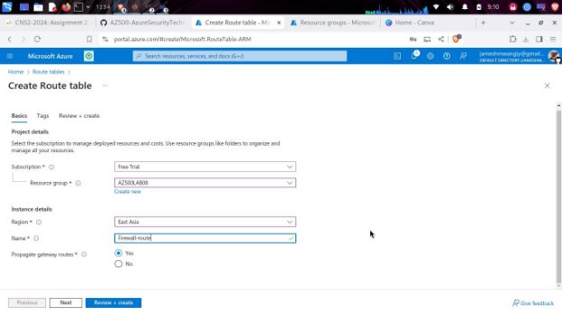

4. Click **Review + create**, then click **Create**, and wait for the provisioning to complete. 
4. On the **Route tables** blade, click **Refresh**, and, in the list of route tables, click the **Firewall-route** entry.
4. On the **Firewall-route** blade, in the **Settings** section, click **Subnets** and then, on the **Firewall-route | Subnets** blade, click **+ Associate**.
4. On the **Associate subnet** blade, specify the following settings:

   Setting Value Virtual network **Test-FW-VN**

   Setting Value

   Subnet **Workload-SN**

   **Note**: Ensure the **Workload-SN** subnet is selected for this route, otherwise the firewall won’t work correctly.

   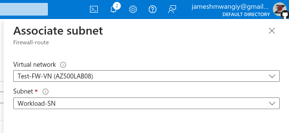

8. Click **OK** to associate the firewall to the virtual network subnet.
8. Back on the **Firewall-route** blade, in the **Settings** section, click **Routes** and then click **+ Add**.
8. On the **Add route** blade, specify the following settings:

8

Setting

Route name

Address prefix destination Destination IP addresses/CIDR ranges Next hop type

Next hop address

Value

**FW-DG**

**IP Address 0.0.0.0/0**

**Virtual appliance**

the private IP address of the firewall that you identified in the previous task

**Note**: Azure Firewall is actually a managed service, but virtual appliance works in this situation

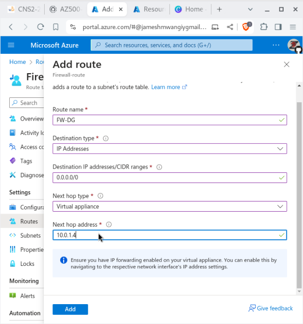

11. Click **Add** to add the route.

**Task 4: Configure an application rule**

In this task you will create an application rule that allows outbound access to www.bing.com.

1. In the Azure portal, navigate back to the **Test-FW01** firewall.
1. On the **Test-FW01** blade, in the **Settings** section, click **Rules (classic)**.
3. On the **Test-FW01 | Rules (classic)** blade, click the **Application rule collection** tab, and then click **+ Add application rule collection**.
3. On the **Add application rule collection** blade, specify the following settings (leave others with their default values):

   Setting Value Name **App-Coll01** Priority **200**

   Action **Allow**

5. On the **Add application rule collection** blade, create a new entry in the **Target FQDNs** section with the following settings (leave others with their default values):

   Setting Value

   name **AllowGH** Source type **IP Address** Source **10.0.2.0/24**

   Protocol port **http:80, https:443** Target FQDNS **www.bing.com**

6. Click **Add** to add the Target FQDNs-based application rule.

   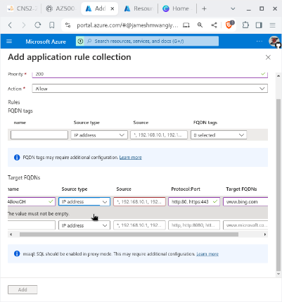

   **Note**: Azure Firewall includes a built-in rule collection for infrastructure FQDNs that are allowed by default. These FQDNs are specific for the platform and can’t be used for other purposes.

**Task 5: Configure a network rule**

In this task, you will create a network rule that allows outbound access to two IP addresses on port 53 (DNS).

1. In the Azure portal, navigate back to the **Test-FW01 | Rules (classic)** blade.
1. On the **Test-FW01 | Rules (classic)** blade, click the **Network rule collection** tab and then click **+ Add network rule collection**.
1. On the **Add network rule collection** blade, specify the following settings (leave others with their default values):

   Setting Value Name **Net-Coll01** Priority **200**

   Action **Allow**

4. On the **Add network rule collection** blade, create a new entry in the **IP Addresses** section with the following settings (leave others with their default values):

11

Setting

Name

Protocol

Source type

Source Addresses

Destination type

Destination Address

Destination Ports

5. Click **Add** to add the network rule.

Value

**AllowDNS**

**UDP**

**IP address**

**10.0.2.0/24**

**IP address 209.244.0.3,209.244.0.4 53**

**Note**: The destination addresses used in this case are known public DNS servers.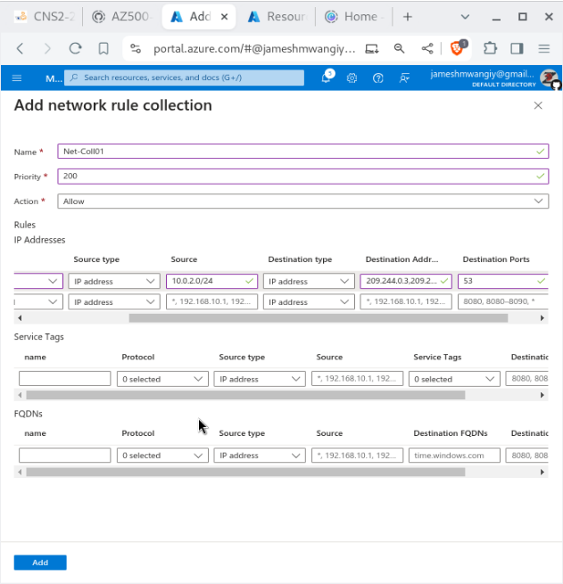

**Task 6: Configure the virtual machine DNS servers**

In this task, you will configure the primary and secondary DNS addresses for the virtual machine. This is not a firewall requirement.

1. In the Azure portal, navigate back to the **AZ500LAB08** resource group.
1. On the **AZ500LAB08** blade, in the list of resources, click the **Srv-Work** virtual machine.
1. On the **Srv-Work** blade, in the **Settings** section, click **Networking**.
1. On the **Srv-Work | Networking** blade, click the link next to the **Network interface** entry.
1. On the network interface blade, in the **Settings** section, click **DNS servers**, select the **Custom** option, add the two DNS servers referenced in the network rule: **209.244.0.3** and **209.244.0.4**, and click **Save** to save the change.

   While adding a server , there was an error that the IP addresses were not valid.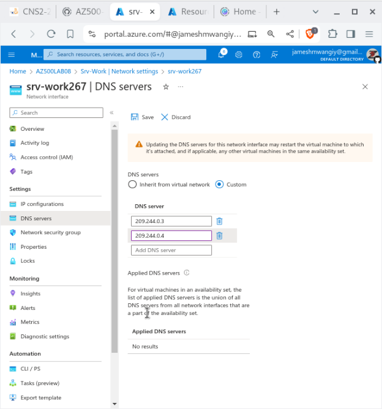

   The error is as a result of configuring the DNS server in the previous task as 209.244.0.3,209.244.0.4

   Adding a spacing after the comma allows for the IP input to be read accordingly by the firewall

   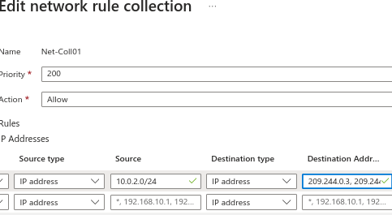

   After fixing the Destination address, the changes are saved.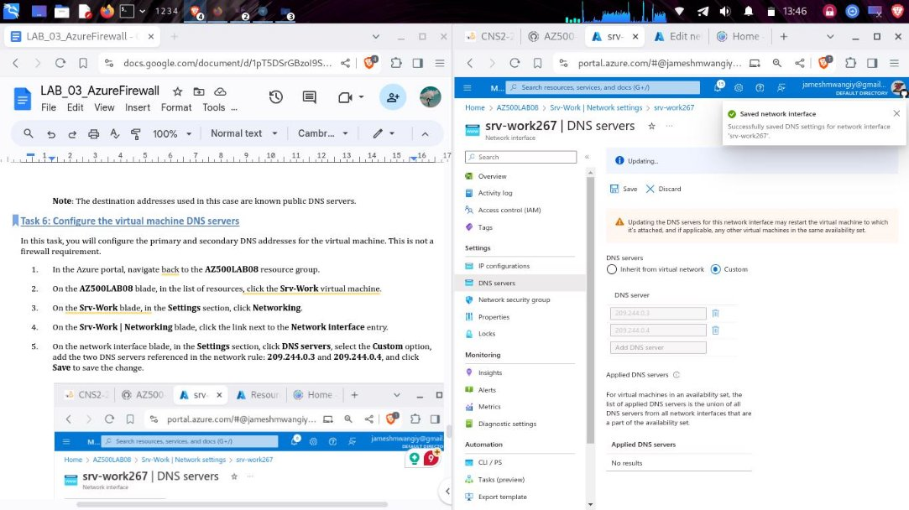

6. Return to the **Srv-Work** virtual machine page. **Note**: Wait for the update to complete.

   **Note**: Updating the DNS servers for a network interface will automatically restart the virtual machine to which that interface is attached, and if applicable, any other virtual machines in the same availability set.

**Task 7: Test the firewall**

In this task, you will test the firewall to confirm that it works as expected.

1. In the Azure portal, navigate back to the **AZ500LAB08** resource group.
1. On the **AZ500LAB08** blade, in the list of resources, click the **Srv-Jump** virtual machine.
3. On the **Srv-Jump** blade, click **Connect** and, in the drop down menu, click **RDP**.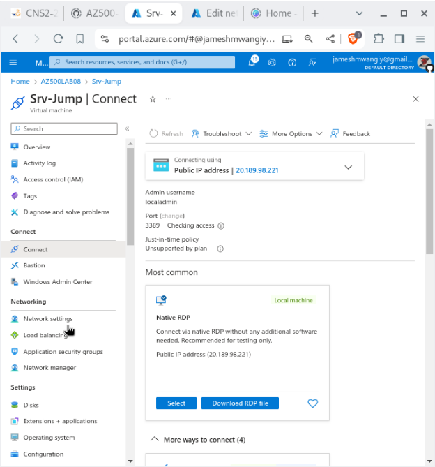
3. Click **Download RDP File** and use it to connect to the **Srv-Jump** Azure VM via Remote Desktop. When prompted to authenticate, provide the following credentials:

   Setting Value

   User name **localadmin**

   Password The secure password you chose

during deployment of the custom template in task 1 step 6.

**In Linux the remote desktop client Remmima , fill in the username and password field.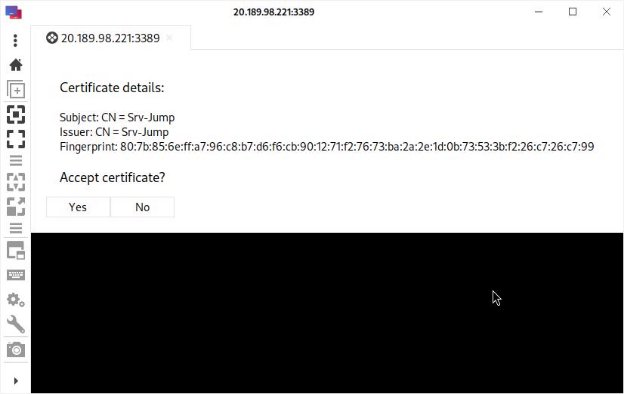**

**For the server field input the server address in the rdp file downloaded 20.189.98.221:3389**

**Note**: The following steps are performed in the Remote Desktop session to the **Srv-Jump** Azure VM.

**Note**: You will connect to the **Srv-Work** virtual machine. This is being done so we can test the ability to access the bing.com website.

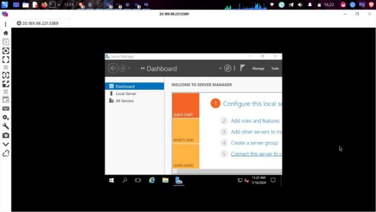

5. Within the Remote Desktop session to **Srv-Work**, in **Server Manager**, click **Local Server** and then click **IE Enhanced Security Configuration**.
5. In the **Internet Explorer Enhanced Security Configuration** dialog box, set both options to **Off** and click **OK**.

   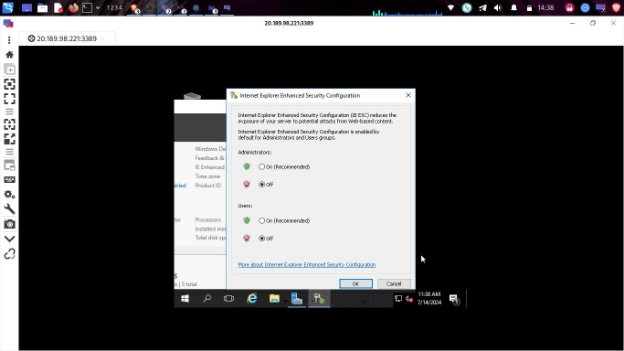

7. Within the Remote Desktop session to **Srv-Work**, start Internet Explorer and browse to **https://www.bing.com**.

   The connection to bing.com goes through

   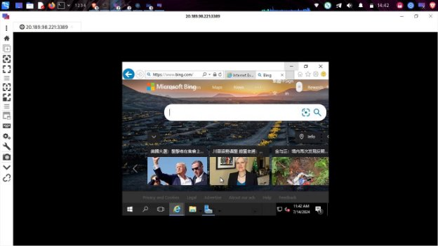

   **Note**: The website should successfully display. The firewall allows you access.

8. Browse to **http://www.microsoft.com/**

   **Note**: Within the browser page, you should receive a message with text resembling the following: HTTP request from 10.0.2.4:xxxxx to microsoft.com:80. Action: Deny. No rule matched. Proceeding with default action. This is expected, since the firewall blocks access to this website.

   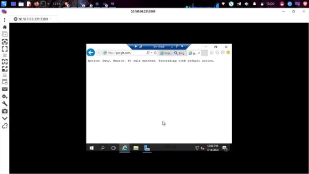

9. Terminate both Remote Desktop sessions.

Result: You have successfully configured and tested the Azure Firewall. **Clean up resources**

Remember to remove any newly created Azure resources that you no longer use. Removing unused resources ensures you will not incur unexpected costs.

1. In the Azure portal, open the Cloud Shell by clicking the first icon in the top right of the Azure Portal. If prompted, click **PowerShell** and **Create storage**.
1. Ensure **PowerShell** is selected in the drop-down menu in the upper-left corner of the Cloud Shell pane.
1. In the PowerShell session within the Cloud Shell pane, run the following to remove the resource group you created in this lab:

   Remove-AzResourceGroup -Name "AZ500LAB08" -Force -AsJob

4. Close the **Cloud Shell** pane.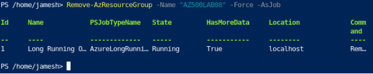

   **Conclusion**

   In this lab, I deployed and configured Azure Firewall, gaining hands-on experience in setting up a secure network boundary within an Azure Virtual Network. I created and applied network and application rules to control inbound and outbound traffic, ensuring proper access restrictions based on IP addresses, ports, and applications. Through a remote connection to Srv-work I conducted testing and validation, confirming the effectiveness of the firewall rules. This lab demonstrated Azure Firewall as a robust network security solution, equipping me with practical skills for securing Azure infrastructures.
17

[ref1]: Aspose.Words.c4eae09f-e4bf-4948-b1e5-e9192d635ae1.001.png
