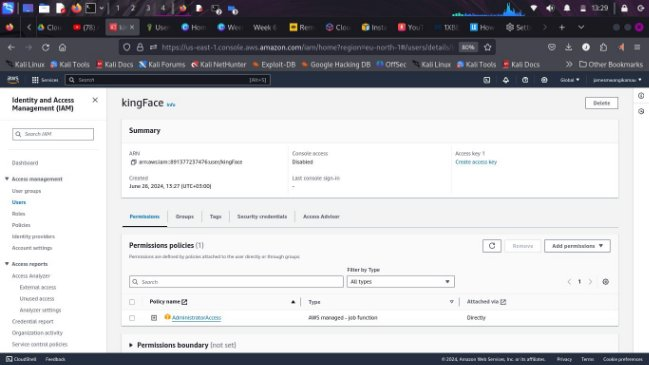

# *Introduction*

 Cloud Identity and Access Management (**Cloud IAM**) is a framework for managing digital identities and controlling access to resources in cloud environments. It involves verifying user identities (authentication), controlling user actions and resource access (authorization), and assigning permissions based on roles (role-based access control). Cloud IAM also includes defining and enforcing access policies (***policy*** management), tracking user activities for security and compliance (auditing and monitoring), integrating with external identity providers (federation), allowing one login for multiple services (single sign-on), and ensuring adherence to regulatory and security standards (compliance and governance). Popular solutions for Cloud IAM include  [AWS IAM](https://www.google.com/url?sa=t&source=web&rct=j&opi=89978449&url=https://aws.amazon.com/iam/&ved=2ahUKEwjCqMqYg4uHAxXJ_7sIHXRfBloQFnoECCIQAQ&usg=AOvVaw0W_hC7qZ85U6fOwNdNAueB),[ Google Cloud IAM](https://www.google.com/url?sa=t&source=web&rct=j&opi=89978449&url=https://cloud.google.com/security/products/iam&ved=2ahUKEwjFq_rVg4uHAxUAh_0HHZjVCaEQFnoECCUQAQ&usg=AOvVaw0apwG1R_q5_Ff8X-N9uTQ4), and [Microsoft Entra ID (formerly Azure Active Directory) ](https://www.google.com/url?sa=t&source=web&rct=j&opi=89978449&url=https://www.microsoft.com/en-us/security/business/identity-access/microsoft-entra-id&ved=2ahUKEwiJ0pPmg4uHAxUXif0HHQXPA3oQFnoECB0QAQ&usg=AOvVaw3H1oDe3sJ5UkwkqCUGOVZM)
[CloudGoat](https://github.com/RhinoSecurityLabs/cloudgoat) developed by Rhino Security Labs, is a tool designed to intentionally deploy vulnerable AWS environments for the purpose of practicing cloud cybersecurity skills. It sets up various "capture-the-flag" scenarios that simulate real-world security challenges. One scenario provided by CloudGoat is "**iam\_privesc\_by\_rollback**," which focuses on demonstrating how privilege escalation can occur in AWS through the rollback of IAM policies. This scenario allows users to explore and understand the risks associated with IAM policy rollbacks and to practice mitigating such vulnerabilities. 
# *Objective:*
To understand and practice privilege escalation techniques in AWS IAM (Identity and Access Management) using the CloudGoat scenario "iam\_privesc\_by\_rollback."

Install and Configure the AWS CLI  in the local environment:

Navigate over to [https://aws.amazon.com/cli/  . We](https://aws.amazon.com/cli/) follow the steps to install the AWS CLI on Linux. To verify a successful install, we check the $aws –version .

Our output shows the versions , indicating the AWS cli is installed and configured. 

We navigate to AWS IAM service and create a user , in this case our user is “kingFace”.  Next we configure the policy and assign AdministratorAccess to our user kingFace.  

# *The user is successfully created. Thus we need to create access keys to Access the profile from the Terminal.*
To create access keys we go to security credentials and proceed to create the access keys. 

We select the cli use case.

We then create a description followed by retrieving the access keys.

As we create access keys we are notified of best practices for managing AWS access keys. They are essential for security and risk reduction. These include using IAM roles instead of access keys to reduce exposure, deleting unused keys, and regularly rotating them to limit potential unauthorized access. Applying the principle of least privilege minimizes damage if credentials are misused. Monitoring and auditing regularly to detect suspicious activities, while avoiding hard-coding keys prevents accidental exposure. Encrypting sensitive data, enabling multi-

factor authentication (MFA), and using condition keys in IAM policies add layers of protection. 

Regular reviews of IAM users, roles, and policies ensure compliance and address vulnerabilities. Exposed access keys can give access to malicious attackers to get into the cloud environment. 

We can verify connecting to our profile by the provided access keys, by running aws s3 ls to list available s3 buckets. From the image above we have one bucket “jamesmwangi’.

Next we install the required dependencies and software to run cloudgoat.

` `We run into an error while trying to configure a profile as recommended. 

And yet verifying if Terraform was installed by checking the version, indicated the software was installed.  *As a way to trouble shoot , opened the cloudgoat.py code* 

in cloudgoat.py line 103 we can see that if the version requirement is unmet, the error will indicate Terraform not found. Same error as when Terraform is not installed.

We can update to the latest version using tfenv CLI tool.  After updating to the latest version the *$ ./cloudgoat.py config profile*** finally runs without errors.  This troubleshooting exercise revealed the principle of checking the related configuration scripts and documentation before trying out solutions from Google and forums. 

When prompted to create a default profile we choose yes, then we configure the profile as Kface. We use the access keys we obtained earlier. 

We configure the profile and whitelist our IP address. The steps to the scenario:

*https://github.com/RhinoSecurityLabs/cloudgoat/tree/master/scenarios/iam\_privesc\_by\_rollback*

We start by running ./cloudgoat.py create iam\_privesc\_by\_rollback. 

From the output we can get credentials to set up Raynor profile.

To configure the profile we use :aws configure --profile Raynor 

We also run :aws –profile Raynor sts get-caller-identity to obtain the username from the arn value, which we’ll use later. 

*$aws iam list-attached-user-policies --user-name raynor-iam\_privesc\_by\_rollback\_cgid53i9v2ug4p --profile Raynor *The above command lists the policies associated with the Raynor user. 

The displayed policy includes the policy name and the Amazon Resource Name (ARN) 

Next we run : $*aws iam list-policy-versions --policy-arn arn:aws:iam::891377237476:policy/cg-raynor-policy- iam\_privesc\_by\_rollback\_cgid53i9v2ug4p --profile Raynor* 

We wish to find the available versions entailed in the policy versions. 

The default version is v1. That is the version Raynor has access to. V1:

It has 3 allowed actions. With *Get, List*, and *SetDefaultPolicyVersion* permissions, an attacker could exploit the *SetDefaultPolicyVersion* permission to switch to an older policy version that grants full admin rights. They would identify which version offers full admin rights and then set it as the default.

We can test if v1, the default version can allow us to run other commands other than the 3 allowed . We get an error , “UnauthorizedOperation”.

V2:![ref1]

v2 allows access to the Buckets and all resources. Concerning s3 buckets, one can *List* ,*Get*  and list all buckets.![ref1]

V3:

v3 has administrator access allowing all actions. We’ll try to switch to this version later to run any command. With such access the attacker can be able to execute any instruction on our cloud environment.

V4:

v4 introduces the concept of timed access. Access to the profile expires after the time duration. To enhance security, this ensures we allow privileged access only when needed. The profile access will expire after a set duration, and it allows only the Get action.

V5:

v5 allows administrative access exclusively from a previously whitelisted private IP address while blocking all non-whitelisted IP addresses from accessing any actions.

Next we can now set the default policy version to v3. We can also verify the change . From the output we observe that v3 is now the default version.

Now we can test if Raynor can run the describe instances operation.

The operation runs unrestricted. An attacker can potentially gain full admin privileges and execute any malicious actions they desire, as demonstrated in this exercise. 

One way to monitor policies on  AWS is [CloudTrail. ](https://www.google.com/url?sa=t&source=web&rct=j&opi=89978449&url=https://docs.aws.amazon.com/awscloudtrail/latest/userguide/cloudtrail-user-guide.html&ved=2ahUKEwiRr-3u_YuHAxXsRvEDHY6xC9YQFnoECBgQAw&usg=AOvVaw0K8r0n2ydKFxUtfEVCAThg)Monitoring and auditing API calls with CloudTrail help detect suspicious activities and respond to security incidents promptly. 
# *Conclusion*
The CloudGoat IAM exercise showcases critical security vulnerabilities within IAM configurations. The exercise brings out the need to have robust monitoring , access control and policy management. To mitigate the risk of privileged escalation, carefully control who has the *SetDefaultPolicyVersion* permission. Regularly review policy versions and their permissions. Remove or deactivate any outdated or insecure policy versions. The exercise serves as a valuable lesson in securing IAM configurations to safeguard against potential breaches and maintain the integrity of cloud environments.

[ref1]: Aspose.Words.36c8e6b8-41a0-47aa-81b6-529b413dbd1c.022.jpeg
