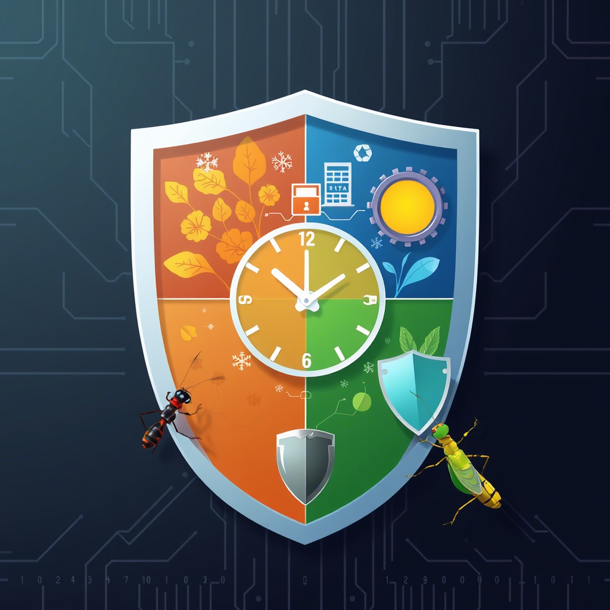

# Master the quartely clock. Understand the seasons

Mangoes are seasonal fruits, and in some parts of the world, nature follows a rhythm of four distinct seasons: Autumn, Summer, Spring, and Winter.  

Mastering the quarterly clock and understanding these seasons , is a valuable skill. It allows you to align your activities with predictable cycles, ensuring you’re never caught unprepared. After all, you’ve lived through similar seasons before!  

Below is a simple image that shows an outline of how you can break down everything you do into 4 parts.  

You can also break down the year into 
1. Jan- Apr      (January,February,March and April)
1. May- Aug    (May , June ,July, and August )
1. Sept - Dec    (September , October, November, and December )

This oath to master seasons is echoedthrough a very popular fable . The African fable tells of a carefree grasshopper 🦗 that neglected to save food during plentiful times. Meanwhile, its neighbors, the ants 🐜, worked  to harvest  supplies for the drought season. When the dry season  arrived, the ants had plenty of food while the grasshopper struggled.  What's the lesson from the fable? Prepare for bad seasons during the good ones.  

In this digital age you need a cybersecurity strategy. 

Therefore ;  
" Align your cybersecurity strategy with quarterly cycles to anticipate risks, optimize preparedness, and thrive in evolving threat landscapes. "

_The end._

