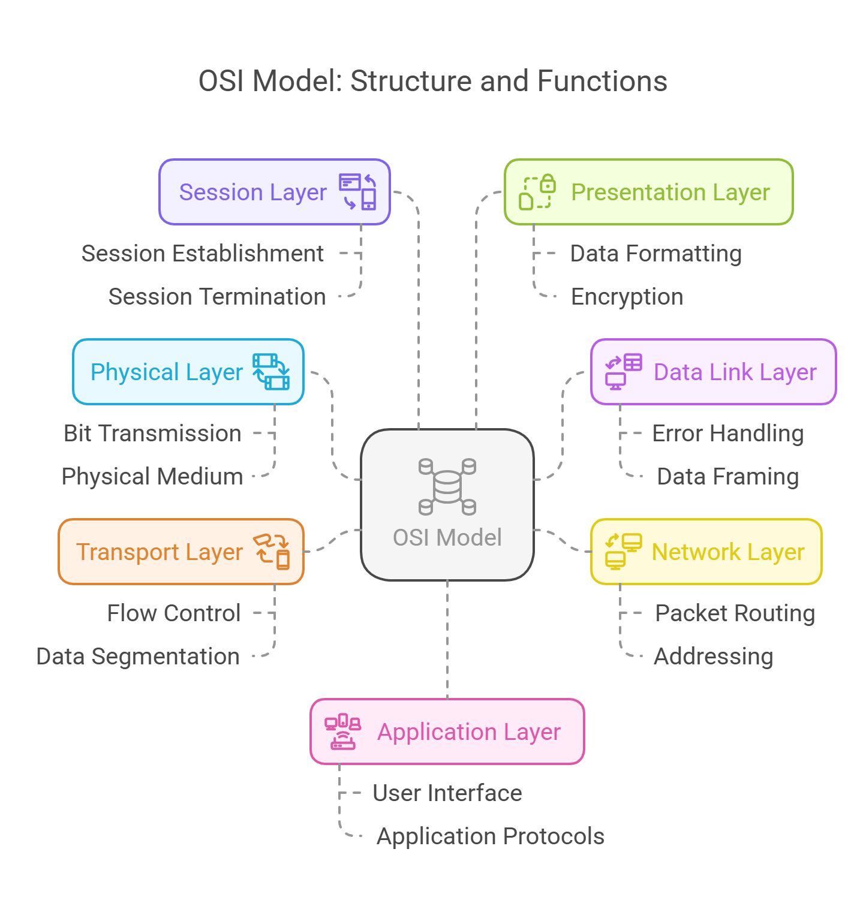
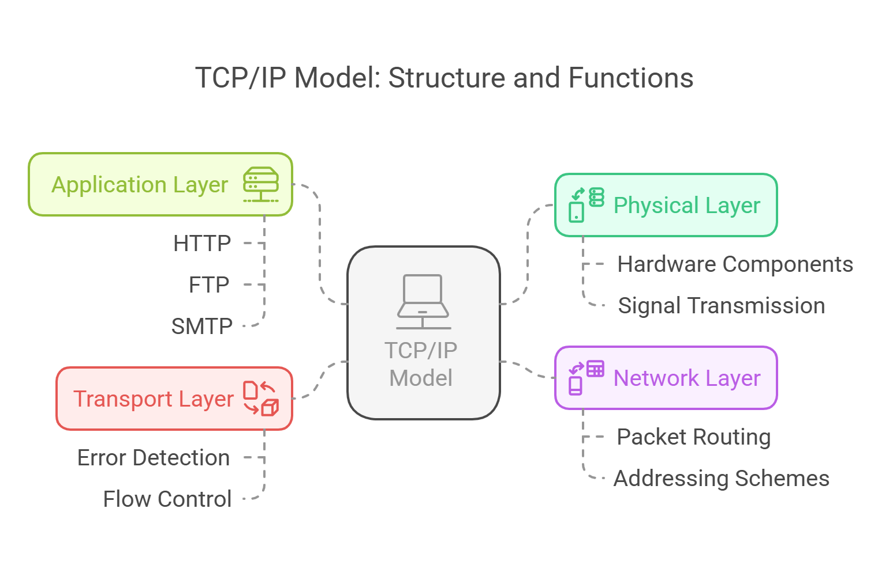

# Visualizing the TCP-IP and OSI Models in Network Communication
### Introduction to OSI model and TCP- IP model 

**The OSI Model**

The OSI model consists of seven layers, each with its own specific functions:

Physical Layer: This layer is responsible for the physical connection between devices, including the transmission of raw bitstreams over a physical medium.

Data Link Layer: This layer provides node-to-node data transfer and handles error correction from the physical layer. It ensures that data packets are transmitted without errors.

Network Layer: The network layer is responsible for routing data packets between devices across different networks. It manages addressing and determines the best path for data transmission.

Transport Layer: This layer ensures complete data transfer and error recovery. It provides end-to-end communication and can manage flow control and segmentation of data.

Session Layer: The session layer manages sessions between applications. It establishes, maintains, and terminates connections between applications.

Presentation Layer: This layer translates data between the application layer and the network. It is responsible for data formatting, encryption, and compression.

Application Layer: The topmost layer, the application layer, provides network services directly to end-user applications. It facilitates user interface and application-level protocols.

The OSI model was developed in 1984 by the International Organization for Standardization (ISO) and serves as a theoretical framework for understanding network interactions.

**TCP/IP Model**

The TCP/IP model, on the other hand, consists of four layers:

Physical Layer: Similar to the OSI model, this layer deals with the physical aspects of data transmission over a network.

Network Layer: This layer is responsible for addressing and routing packets of data across networks, ensuring that data can travel from the source to the destination.

Transport Layer: The transport layer provides reliable data transfer services to the upper layers. It manages error detection and correction, as well as flow control.

Application Layer: This layer encompasses all protocols and services that applications use to communicate over the network. It includes protocols such as HTTP, FTP, and SMTP.

The TCP/IP model is more streamlined than the OSI model, combining some of the OSI layers into fewer layers, which reflects the practical implementation of network protocols.

#### Objectives
Using Cisco packet-tracer lab we will approach the project in two parts. 
1. **Part 1: Examine HTTP Web Traffic**
2. **Part 2: Display Elements of the TCP/IP Protocol Suite**
#### Background Scenario
Topology Image:

This simulation activity is intended to provide a foundation for understanding the TCP/IP protocol suite and the relationship to the OSI model. Simulation mode allows you to view the data contents being sent across the network at each layer.
As data moves through the network, it is broken down into smaller pieces and identified so that the pieces can be put back together when they arrive at the destination. Each piece is assigned a specific name (protocol data unit [PDU]) and associated with a specific layer of the TCP/IP and OSI models. Packet Tracer simulation mode enables you to view each of the layers and the associated PDU. The following steps lead the user through the process of requesting a web page from a web server by using the web browser application available on a client PC.

Even though much of the information displayed will be discussed in more detail later, this is an opportunity to explore the functionality of Packet Tracer and be able to visualize the encapsulation process.
### Part 1: Examine HTTP Web Traffic
In Part 1 of this activity, you will use Packet Tracer (PT) Simulation mode to generate web traffic and examine HTTP.
#### Step 1: Switch from Realtime to Simulation mode.
In the lower right corner of the Packet Tracer interface are tabs to toggle between **Realtime** and **Simulation** mode. PT always starts in **Realtime** mode, in which networking protocols operate with realistic timings. However, a powerful feature of Packet Tracer allows the user to “stop time” by switching to Simulation mode. In Simulation mode, packets are displayed as animated envelopes, time is event driven, and the user can step through networking events.
a. Click the **Simulation** mode icon to switch from **Realtime** mode to **Simulation** mode.

b. Select **HTTP** from the **Event List Filters**.
1. HTTP may already be the only visible event. Click **Edit Filters** to display the available visible events. Toggle the **Show All/None** check box and notice how the check boxes switch from unchecked to checked or checked to unchecked, depending on the current state.
1. Click the **Show All/None** check box until all boxes are cleared and then select **HTTP**. Click anywhere outside of the **Edit Filters** box to hide it. The Visible Events should now only display HTTP.
#### Step 2: Generate web (HTTP) traffic.
Currently the Simulation Panel is empty. There are six columns listed across the top of the Event List within the Simulation Panel. As traffic is generated and stepped through, events appear in the list. The **Info** column is used to inspect the contents of a particular event.
**Note:** The Web Server and Web Client are displayed in the left pane. The panels can be adjusted in size by hovering next to the scroll bar and dragging left or right when the double-headed arrow appears.
* a. Click **Web Client** in the far left pane.
* b. Click the **Desktop** tab and click the **Web Browser** icon to open it.
* c. In the URL field, enter **www.osi.local** and click **Go**.Because time in **Simulation** mode is event-driven, you must use the **Capture/Forward** button to display network events.
* d. Click **Capture/Forward** four times. There should be four events in the **Event List**.Look at the Web Client web browser page. Did anything change?The web page was returned from the web server.
#### Step 3: Explore the contents of the HTTP packet.
* a. Click the first colored square box under the **Event List** > **Info** column. It may be necessary to expand the Simulation Panel or use the scrollbar directly below the **Event List**.The **PDU Information at Device: Web Client** window displays. In this window, there are only two tabs **(OSI Model and Outbound PDU Details)** because this is the start of the transmission. As more events are examined, there will be three tabs displayed, adding a tab for **Inbound PDU Details**. When an event is the last event in the stream of traffic, only the **OSI Model** and **Inbound PDU Details** tabs are displayed.
* b. Ensure that the **OSI Model** tab is selected. Under the **Out Layers** column, ensure that the **Layer 7** box is highlighted.

	**Quiz : What is the text displayed next to the **Layer 7** label?**  `HTTP`

	**Quiz : What information is listed in the numbered steps directly below the **In Layers** and **Out Layers** boxes?**  `The HTTP client sends a HTTP request to the server.`
* c. Click **Next Layer**. Layer 4 should be highlighted. What is the **Dst Port** value? `80`
* d. Click **Next Layer**. Layer 3 should be highlighted. What is the **Dest. IP** value? `192.168.1.254`
* e. Click **Next Layer**. 
	** Quiz :**** What information is displayed at this layer?** `Layer 2 Ethernet II Header and inbound and outbound MAC addresses`
* f. Click the **Outbound PDU Details** tab .Information listed under the **PDU Details** is reflective of the layers within the TCP/IP model. **Note:** The information listed under the **Ethernet II** section provides even more detailed information than is listed under Layer 2 on the **OSI Model** tab. The **Outbound PDU Details** provides more descriptive and detailed information. The values under **DEST MAC** and **SRC MAC** within the **Ethernet II** section of the PDU Details appear on the OSI Model tab under Layer 2, but are not identified as such.

	**Quiz : What information is listed in the numbered steps directly below the  **In Layers** and  **Out Layers**  boxes for Layer 7?**   
	`In Layer:  server receives a HTTP request.  
	Out Layer: The server sends back a HTTP reply to the client.`

	**Quiz : :  What is the  ** Dst Port **  value for  ** Layer 4 **  under the  ** Out Layers **  column?** `Port 1027 `

	**Quiz : : What is the  ** Dest. IP **  value for  ** Layer 3 **  under the  ** Out Layers **  column?** `IP: 192.168.1.1` 

	**Quiz :: What information is displayed at Layer 2 under the  **Out Layers**  column?** 
	`The next-hop IP address is a unicast. The ARP process looks it up in the ARP table.   The next-hop IP address is in the ARP table. The ARP process sets the frame's destination MAC address to the one found in the table.  The device encapsulates the PDU into an Ethernet frame. `  
* g. Click the next colored square box under the **Event List** > **Info** column. Only Layer 1 is active (not grayed out). The device is moving the frame from the buffer and placing it on to the network.
* h. Advance to the next HTTP **Info** box within the **Event List** and click the colored square box. This window contains both **In Layers** and **Out Layers**. Notice the direction of the arrow directly under the **In Layers** column; it is pointing upward, indicating the direction the information is travelling. Scroll through these layers making note of the items previously viewed. At the top of the column the arrow points to the right. This denotes that the server is now sending the information back to the client.

	**Quiz : What is the common information listed under the  IP  section of  **PDU Details**  as compared to the information    listed under the  **OSI Model**  tab?** 
	`The Src and Dst Ports, Src and Dst IPs and MAC addresses have been swapped.`  
	**Quiz : With which layer is it associated?**
	 `Layer 3`

	**Quiz : What is the common information listed under the **TCP **section of** PDU Details, **as compared to the information listed under the** OSI Model **tab, and with which layer is it associated?**
	`Src port : 80 and Destination port :1027 . Layer 4.`

	**Quiz :What is the Host listed under the **HTTP**section of the PDU Details? What layer would this information be associated with under the OSI Model tab?**
	
	`HTTP Data:Accept-Language: en-us Accept: Layer 7`

* i. Click the **Outbound PDU Details** tab. Scroll down to the **HTTP** section.
	**Quiz : What is the first line in the HTTP message that displays?** `HTTP/1.1 200 OK – this means that the request was successful and the page delivered from the server.`
* j. Click the last colored square box under the **Info** column.

	**Quiz : How many tabs are displayed with this event and why?** `Just 2, one for the OSI Model and one for Inbound PDU Details because this is the receiving device`
### Part 2: Display Elements of the TCP/IP Protocol Suite
In Part 2 of this activity, you will use the Packet Tracer Simulation mode to view and examine some of the other protocols comprising of the TCP/IP suite.
#### Step 1: View Additional Events

a. Close any open PDU information windows.
b. In the Event List Filters > Visible Events section, click **Show All**.
What additional Event Types are displayed?Depending on whether any communications has occurred prior to starting the original simulation, there should now be entries for ARP, DNS, TCP and HTTP. It is possible that the ARP entries may not show, depending on what a student may have done prior to going to simulation mode. If the activity is started from scratch all of those will be listed.
These extra entries play various roles within the TCP/IP suite. If the Address Resolution Protocol (ARP) is listed, it searches MAC addresses. DNS is responsible for converting a name (for example, **www.osi.local**) to an IP address. The additional TCP events are responsible for connecting, agreeing on communication parameters, and disconnecting the communications sessions between the devices. These protocols have been mentioned previously and will be further discussed as the course progresses. Currently there are over 35 possible protocols (event types) available for capture within Packet Tracer.

c. Click the first DNS event in the Info column. Explore the **OSI Model** and **PDU Detail** tabs and note the encapsulation process. As you look at the **OSI Model** tab with **Layer 7** highlighted, a description of what is occurring is listed directly below the **In Layers** and **Out Layers** (“1. The DNS client sends a DNS query to the DNS server.”). This is very useful information to help understand what is occurring during the communication process.

d. Click the **Outbound PDU Details** tab. 

**Quiz : What information is listed in the **NAME** : in the DNS QUERY section?**

[www.osi.local ](http://www.osi.local/)

e. Click the last DNS Info colored square box in the event list. **Quiz : Which device is displayed?The Web ClientWhat is the value listed next to ADDRESS: in the DNS ANSWER section of the Inbound PDU Details?**

 `192.168.1.254 . This is the address of the Web Server`

f. Find the first **HTTP** event in the list and click the colored square box of the **TCP** event immediately following this event. Highlight **Layer 4** in the **OSI Model** tab. In the numbered list directly below the **In Layers** and **Out Layers**, 

**Quiz : What is the information displayed under items 4 and 5?** 

`Under item 4. The TCP connection is successful While Under item 5. The device sets the connection state to "ESTABLISHED".`

TCP manages the connecting and disconnecting of the communications channel along with other responsibilities. This particular event shows that the communication channel has been ESTABLISHED.g. Click the last TCP event. Highlight Layer 4 in the **OSI Model** tab. Examine the steps listed directly below **In Layers** and **Out Layers**. 

**Quiz : What is the purpose of this event, based on the information provided in the last item in the list (should be item 4)?** 

`The purpose is  CLOSING the connection.`
#### Challenge
This simulation provided an example of a web session between a client and a server on a local area network (LAN). The client makes requests to specific services running on the server. The server must be set up to listen on specific ports for a client request. (Hint: Look at Layer 4 in the **OSI Model** tab for port information.)
**Challenge Questions** 
what port number is the **Web Server** listening on for the web request?
 Port 1027 
What port is the **Web Server** listening on for a DNS request? 
 Port 53 

 _Below are Images gallery showcasing various visualization in the project_

**Conclusion**
  

 I gained a clear and practical understanding of the TCP/IP and OSI models. By tracing HTTP requests through each layer, the visualization of data encapsulation and transmission offered an insightful, hands-on approach to networking concepts. The structured breakdown of protocols, ports, and data flow visually presented the critical role that each layer plays in ensuring smooth communication across a network. This exercise is good for anyone seeking to grasp fundamental networking principles . 

