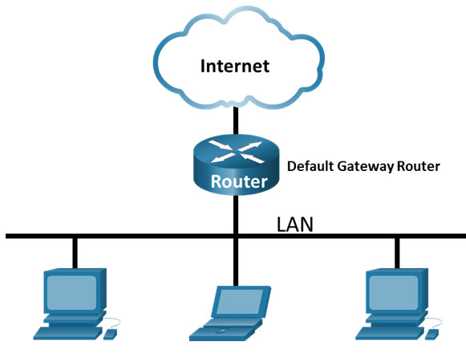
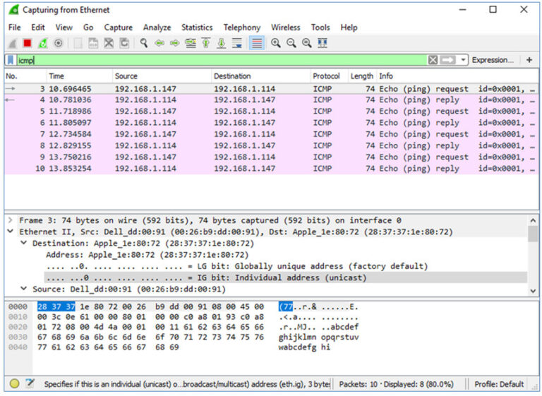

## Use Wireshark to View Network Traffic
### Topology

### Objectives
* **Part 1: Capture and Analyze Local ICMP Data in Wireshark**
* **Part 2: Capture and Analyze Remote ICMP Data in Wireshark**
### Background / Scenario
Wireshark is a software protocol analyzer, or “packet sniffer” application, used for network troubleshooting, analysis, software and protocol development, and education. As data streams travel back and forth over the network, the sniffer “captures” each protocol data unit (PDU) and can decode and analyze its content according to the appropriate RFC or other specifications.
Wireshark is a useful tool for anyone working with networks and can be used with most labs in the CCNA courses for data analysis and troubleshooting. In this lab, you will use Wireshark to capture ICMP data packet IP addresses and Ethernet frame MAC addresses.
### Instructions
### Part 1: Capture and Analyze Local ICMP Data in Wireshark
In Part 1 of this lab, you will ping another PC on the LAN and capture ICMP requests and replies in Wireshark. You will also look inside the frames captured for specific information. This analysis should help to clarify how packet headers are used to transport data to their destination.
#### Step 1: Retrieve your PC interface addresses.
For this lab, you will need to retrieve your PC IP address and its network interface card (NIC) physical address, also called the MAC address.
a. In a command prompt window, enter **ipconfig /all**, to the IP address of your PC interface, its description, and its MAC (physical) address.
```
C:\Users\Student> ipconfig /all
Windows IP Configuration
Host Name . . . . . . . . . . . . : DESKTOP-NB48BTC
   Primary Dns Suffix  . . . . . . . :
   Node Type . . . . . . . . . . . . : Hybrid
   IP Routing Enabled. . . . . . . . : No
   WINS Proxy Enabled. . . . . . . . : No
Ethernet adapter Ethernet:

   Connection-specific DNS Suffix  . :
   Description . . . . . . . . . . . : Intel(R) 82577LM Gigabit Network Connection
   Physical Address. . . . . . . . . :00-26-B9-DD-00-91
   DHCP Enabled. . . . . . . . . . . : No
   Autoconfiguration Enabled . . . . : Yes
   Link-local IPv6 Address . . . . . : fe80::d809:d939:110f:1b7f%20(Preferred)
   IPv4 Address. . . . . . . . . . . : 192.168.1.147(Preferred)
   Subnet Mask . . . . . . . . . . . : 255.255.255.0
   Default Gateway . . . . . . . . . : 192.168.1.1
  <output omitted>
```
b. Ask a team member or team members for their PC IP address and provide your PC IP address to them. Do not provide them with your MAC address at this time.
#### Step 2: Start Wireshark and begin capturing data.
a. Navigate to Wireshark. Double-click the desired interface to start the packet capture. Make sure the desired interface has traffic.
b. Information will start scrolling down the top section in Wireshark. The data lines will appear in different colors based on protocol.
This information can scroll by very quickly depending on what communication is taking place between your PC and the LAN. We can apply a filter to make it easier to view and work with the data that is being captured by Wireshark.
For this lab, we are only interested in displaying ICMP (ping) PDUs. Type **icmp** in the **Filter** box at the top of Wireshark and press **Enter,** or click the **Apply** button (arrow sign) to view only ICMP (ping) PDUs.
c. This filter causes all data in the top window to disappear, but you are still capturing the traffic on the interface. Navigate to a command prompt window and ping the IP address that you received from your team member.
Notice that you start seeing data appear in the top window of Wireshark again.

**Note:** If the PC of your team member does not reply to your pings, this may be because the PC firewall of the team member is blocking these requests. Please see Appendix A: Allowing ICMP Traffic Through a Firewall for information on how to allow ICMP traffic through the firewall using Windows.
d. Stop capturing data by clicking the **Stop Capture** icon.
#### Step 3: Examine the captured data.
In Step 3, examine the data that was generated by the ping requests of your team member PC. Wireshark data is displayed in three sections: 1) The top section displays the list of PDU frames captured with a summary of the IP packet information listed; 2) the middle section lists PDU information for the frame selected in the top part of the screen and separates a captured PDU frame by its protocol layers; and 3) the bottom section displays the raw data of each layer. The raw data is displayed in both hexadecimal and decimal form.
a. Click the first ICMP request PDU frames in the top section of Wireshark. Notice that the Source column has your PC IP address, and the **Destination** column contains the IP address of the teammate PC that you pinged.
b. With this PDU frame still selected in the top section, navigate to the middle section. Click the plus sign to the left of the Ethernet II row to view the destination and source MAC addresses.
_<u>Does the source MAC address match your PC interface?</u>_
Yes
_<u>Does the destination MAC address in Wireshark match your team member MAC address?</u>_
Yes
_<u>How is the MAC address of the pinged PC obtained by your PC?</u>_
The MAC address is obtained through an ARP request.

**Note:** In the preceding example of a captured ICMP request, ICMP data is encapsulated inside an IPv4 packet PDU (IPv4 header) which is then encapsulated in an Ethernet II frame PDU (Ethernet II header) for transmission on the LAN.
### Part 2: Capture and Analyze Remote ICMP Data in Wireshark
In Part 2, you will ping remote hosts (hosts not on the LAN) and examine the generated data from those pings. You will then determine what is different about this data from the data examined in Part 1.
#### Step 1: Start capturing data on the interface.
a. Start the data capture again.
b. A window prompts you to save the previously captured data before starting another capture. It is not necessary to save this data. Click **Continue without Saving.**
c. With the capture active, ping the following three website URLs from a Windows command prompt:
1) www.yahoo.com2) www.cisco.com3) www.google.com
**Note:** When you ping the URLs listed, notice that the Domain Name Server (DNS) translates the URL to an IP address. Note the IP address received for each URL.
d. You can stop capturing data by clicking the **Stop Capture** icon.
#### Step 2: Examining and analyzing the data from the remote hosts.
Review the captured data in Wireshark and examine the IP and MAC addresses of the three locations that you pinged. List the destination IP and MAC addresses for all three locations in the space provided.
IP address for **www.yahoo.com:**
MAC address for **www.yahoo.com:**
IP address for **www.cisco.com:**
MAC address for **www.cisco.com:**
IP address for **www.google.com:**
MAC address for **www.google.com:**
IP addresses: 98.137.246.7, 96.7.79.147, 172.217.14.100 (these IP addresses may vary)
AC address: This will be the same for all three locations. It is the physical address of the default-gateway LAN interface of the router.
_<u>What is significant about this information?</u>_
The MAC addresses for all three locations are the same.
_<u>How does this information differ from the local ping information you received in Part 1?</u>_
A ping to a local host returns the MAC address of the PC NIC. A ping to a remote host returns the MAC address of the default gateway LAN interface.
### Reflection Question
_<u>Why does Wireshark show the actual MAC address of the local hosts, but not the actual MAC address for the remote hosts?</u>_
MAC addresses for remote hosts are not known on the local network, so the MAC address of the default-gateway is used. After the packet reaches the default-gateway router, the Layer 2 information is stripped from the packet and a new Layer 2 header is attached with the destination MAC address of the next hop router.

`
`
`   `
## **Conclusion**

Wireshark shows the activity and requests in a network. In some seconds interval so many 
requests and communication may happen in a network. Through the command line, one can 
also obtain some information about a network. 

Acknowledgement: This lab is part of Cisco Netacad academy labs on Networking. 
   

